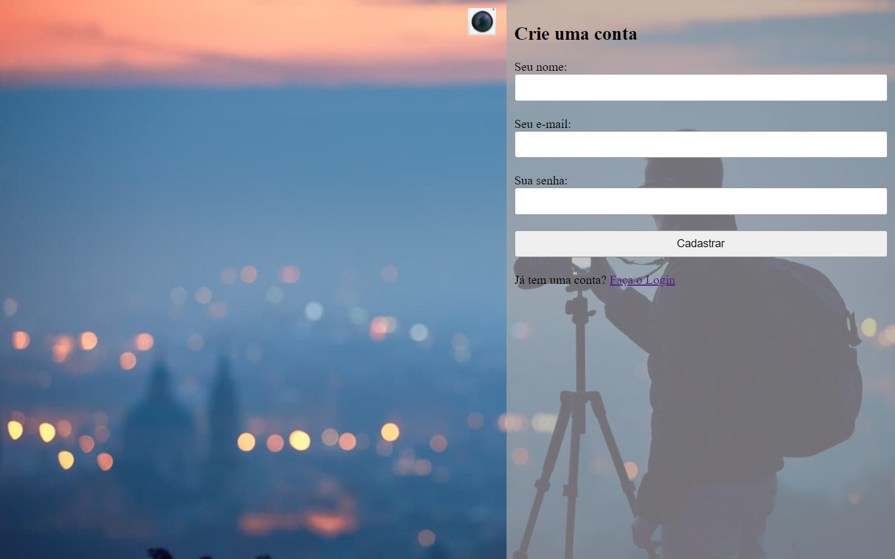

# Descrição
Descrição> uso de Html e Css + Javascript.

Nesse Projeto Eu Uso Um Formulario interativo com sua base no Java,
Como Abrir e Fechar o Menu do Formulario, e Requerimentos Para Ser Preenchido.

Exemplo Nas imagens: Interação// de Abrir e Fechar;

>Aberto

>Fechado

Exemplo Nas imagens: Interação// Requerimentos Para Ser Preenchido.;

>completo

>incompleto
